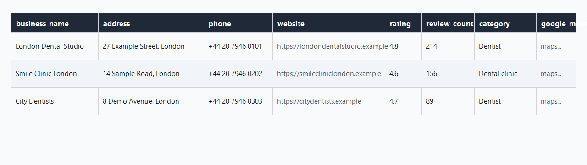

# Google Maps Business Extractor

Standalone Google Maps business extractor for portfolio demos. It runs the free `gosom/google-maps-scraper` Docker tool, filters the results, removes duplicates, and exports clean CSV, JSON, and Excel files.

## What It Exports

Each exported business includes:

| Column | Meaning |
| --- | --- |
| `business_name` | Business name from Google Maps |
| `address` | Business address |
| `phone` | Public phone number |
| `website` | Business website URL |
| `rating` | Google Maps rating |
| `review_count` | Number of Google reviews |
| `category` | Business category |
| `google_maps_link` | Link back to the Google Maps listing/search result |

Rows are skipped when they have no website, only a social/profile link, duplicate website domain, or missing required fields.

## Requirements

- Python 3.10+
- Docker

## Install Docker

Docker is required because the scraper runs `gosom/google-maps-scraper` inside a container.

1. Install Docker Desktop from https://www.docker.com/products/docker-desktop/
2. Start Docker Desktop.
3. Confirm Docker works:

```bash
docker --version
```

The first run may take longer because Docker needs to download the `gosom/google-maps-scraper` image.

## Example Command

```bash
python google_maps_business_extractor.py "dentists London"
```

This creates:

```text
output/dentists_london.csv
output/dentists_london.json
output/dentists_london.xlsx
```

You can also control scrape depth and output directory:

```bash
python google_maps_business_extractor.py "dentists London" --depth 3 --output-dir results
```

## Summary Output

At the end, the script prints how many businesses were found, exported, and skipped:

```text
==========================================================
Businesses found:    42
Businesses exported: 18
Businesses skipped:  24
  - duplicate_website: 4
  - missing_phone: 7
  - no_website: 9
  - social_only: 4

Output files:
  CSV: C:\path\to\output\dentists_london.csv
  JSON: C:\path\to\output\dentists_london.json
  EXCEL: C:\path\to\output\dentists_london.xlsx
==========================================================
```

## CSV Screenshot



Sample CSV data is also available at [`docs/sample_dentists_london.csv`](docs/sample_dentists_london.csv).

## Notes

This project is a clean standalone demo. It does not use SQLite, outreach tracking, lead statuses, or website reachability checks.
